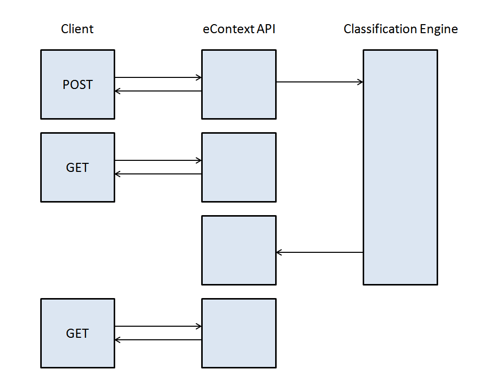

Best Practices
==============

Synchronous vs. Asynchronous calls
----------------------------------

The eContext API allows for both synchronous and asynchronous operation for all calls using the POST method.  By default, asynchronous operations are used.

Some users may prefer synchronous calls for reducing the number of HTTP requests, while others may prefer asynchronous calls to allow for higher
throughput in certain situations. eContext is happy to support both.

Be advised that eContext reserves the right to throttle users sending through excessive calls.

Asynchronous calls
^^^^^^^^^^^^^^^^^^

When using an asynchronous call (the default for classify/\*), a request is
submitted via the API and is queued in the eContext Classification Engine.  A
result object is created immediately and returned to the user to check on
progress, and, when completed, also contains the classification result.  In
general, the workflow looks like this:

This method involves more overhead, including the introduction of a storage backend to allow storage and retrieval of a result set.

However, if your environment is single-threaded, it may be simpler to implement
an algorithm to run process a large dataset using asynchronous calls.  In this case, please be
respectful of your usage.  For example, do not POST a very large number of classification requests (for example, more than 25,000)
before beginning to GET results.  Performance will generally be more stable
if you run several asynchronous calls in a queue, checking for results
periodically so before you submit new requests.

Synchronous Calls
^^^^^^^^^^^^^^^^^

Synchronous calls block and return a result from the eContext
Classification Engine as soon as is completed.  Depending on your programming
environment and capabilities, synchronous calls can be parallelized and allow
for very high throughput, and less load on the eContext Classification Engine.
A typical workflow for synchronous calls would make use of process pools, threads,
queues, etc, in order to run several synchronous calls at the same time.

The synchronous workflow is illustrated below, and eliminates a storage backend,
allowing for slightly increased performance:

Rule-Based vs. Model-Based Classification
-----------------------------------------

eContext offers a unique combination of curated, rule-based classification and machine learned, neural network model-based classification. Users can request classification from one or the other, or use the models as a fallback to the rule-based system.

Classification results from the rule-based system can come from any one of eContext's 500,000+ topic categories, across it's 20+ levels of the hierarchy. Classification from the model-based system can come from one of approximately 3,500 topic categories at the first 3 levels of depth in the hierarchy.

Users can select the method they wish to use with the ``classification_type`` parameter, and the values below:

.. csv-table::
    :header: "Value", "Description"
    :stub-columns: 1

    "0","Uses both methods; attempts the rule-based method first and, if no results, attempts the model-based method"
    "1","Rule-based method, only (default)"
    "2","Mode-based method, only"

.. code-block:: json

   {
    "async":false,
   "classification_type":2,
   "social":[
         "han and luke"
     ]
   }

Fixing Classification Results to a Point in Time
------------------------------------------------

eContext is continually expanding and improving its classification abilities, adding & removing categories in its hierarchy and altering rules that guide classification. New data is available in the eContext service every 24 hours (00:00 UTC).

However, there may be cases where users do not want the classification to change over the course of a long-running job or while processing batches of content across several days.

To ensure this consistency, users may pass in the ``taxonomy_timestamp`` parameter with their request. This parameter accepts a unix timestamp which will instruct the engine to ignore any changes made to the classification system after this date. See the below example:

.. code-block:: json

{
  "async":false,
  "taxonomy_timestamp":1514764800,
  "social":[
        "happy new year!"
    ]
}
